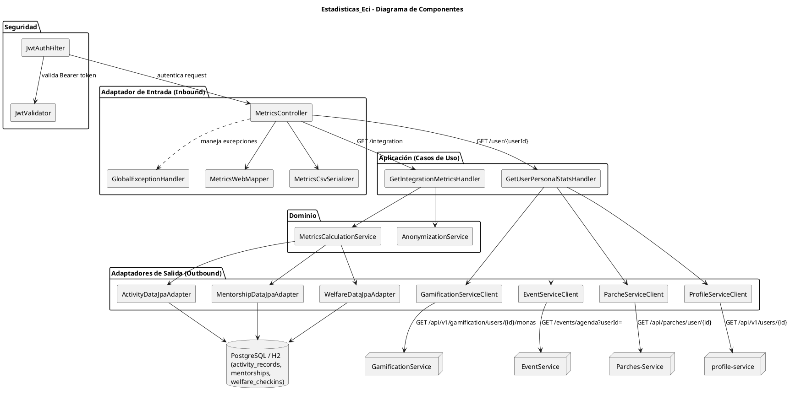
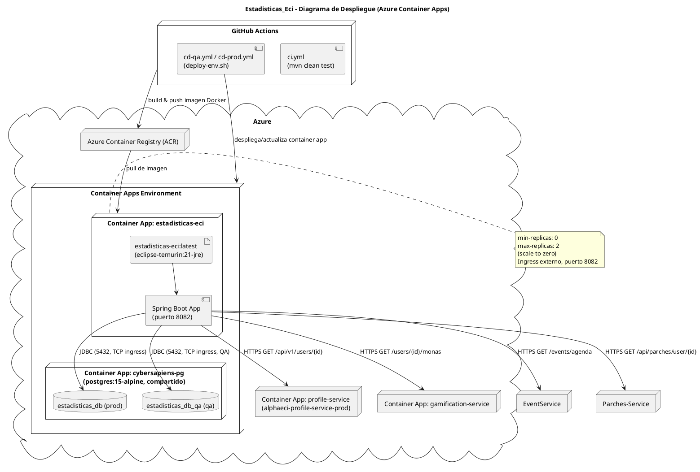
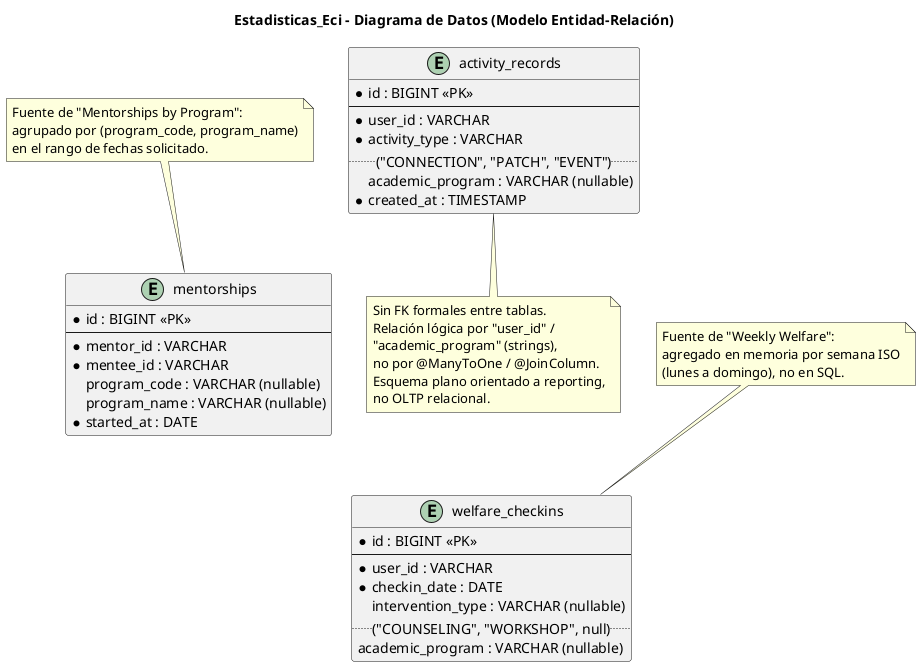

# Diagramas PlantUML — Estadisticas_Eci

Este documento contiene el código PlantUML de los 4 diagramas de arquitectura del microservicio `Estadisticas_Eci`. Basado en el detalle documentado en [`ARQUITECTURA.md`](./ARQUITECTURA.md). Puedes renderizar cada bloque en [plantuml.com/plantuml](https://www.plantuml.com/plantuml) o con la extensión PlantUML de tu IDE.

---

## 1. Diagrama de Clases

Modelo de dominio (`domain/model`), servicios de dominio (`domain/service`) y ports (`domain/port`).

```plantuml
@startuml EstadisticasEci_Clases
title Estadisticas_Eci - Diagrama de Clases (Dominio)

skinparam classAttributeIconSize 0

class AcademicProgram <<record>> {
  +code: String
}

class DateRange <<record>> {
  +from: LocalDate
  +to: LocalDate
}

class NewConnectionRate <<record>> {
  +percentage: double
  +connectedCount: long
  +totalCount: long
}

class InactiveFirstSemester <<record>> {
  +percentage: double
  +inactiveCount: long
  +totalCount: long
}

class MentorshipByProgram <<record>> {
  +programCode: String
  +programName: String
  +mentorshipCount: long
}

class WeeklyWelfare <<record>> {
  +weekStart: LocalDate
  +checkinCount: long
  +interventionCount: long
  +uniqueStudents: long
}

class IntegrationMetrics <<record>> {
  +newConnectionRate: NewConnectionRate
  +inactiveFirstSemester: InactiveFirstSemester
  +mentorshipsByProgram: List<MentorshipByProgram>
  +weeklyWelfare: List<WeeklyWelfare>
}

IntegrationMetrics *-- NewConnectionRate
IntegrationMetrics *-- InactiveFirstSemester
IntegrationMetrics *-- "0..*" MentorshipByProgram
IntegrationMetrics *-- "0..*" WeeklyWelfare

class UserPersonalStats <<record>> {
  +userId: String
  +gamification: GamificationStats
  +event: EventStats
  +parche: ParcheStats
  +profile: ProfileStats
}

class GamificationStats <<record>> {
  +totalXp: int
  +totalMonasUnlocked: int
  +monasInProgress: int
  +monasLocked: int
  +completionPercentage: double
  +monas: List<MonaEntry>
}

class MonaEntry <<record>> {
  +code: String
  +name: String
  +rarity: String
  +status: String
  +unlockedAt: String
}

class EventStats <<record>> {
  +totalAttended: int
  +upcomingEvents: int
  +totalEvents: int
  +eventIds: List<String>
}

class ParcheStats <<record>> {
  +totalJoined: int
  +activeParches: int
}

class ProfileStats <<record>> {
  +xp: int
  +level: int
  +isActive: boolean
  +career: String
  +semester: Integer
}

UserPersonalStats *-- GamificationStats
UserPersonalStats *-- EventStats
UserPersonalStats *-- ParcheStats
UserPersonalStats *-- ProfileStats
GamificationStats *-- "0..*" MonaEntry

class MetricsCalculationService <<domain.service>> {
  +calculate(range: DateRange, program: AcademicProgram): IntegrationMetrics
}

class AnonymizationService <<domain.service>> {
  +ensureNoPii(metrics: IntegrationMetrics): IntegrationMetrics
  -collectStringFields(metrics): List<String>
}

interface ActivityDataPort <<port.out>> {
  +queryNewConnectionRate(range, program): NewConnectionRate
  +queryInactiveFirstSemester(range, program): InactiveFirstSemester
}
interface MentorshipDataPort <<port.out>> {
  +getMentorshipsByProgram(range, program): List<MentorshipByProgram>
}
interface WelfareDataPort <<port.out>> {
  +getWeeklyIndicators(range, program): List<WeeklyWelfare>
}
interface ExternalGamificationPort <<port.out>>
interface ExternalEventPort <<port.out>>
interface ExternalParchePort <<port.out>>
interface ExternalProfilePort <<port.out>>

MetricsCalculationService --> ActivityDataPort
MetricsCalculationService --> MentorshipDataPort
MetricsCalculationService --> WelfareDataPort
MetricsCalculationService ..> IntegrationMetrics : construye

interface GetIntegrationMetricsUseCase <<port.in>> {
  +execute(range, program): IntegrationMetrics
}
interface GetUserPersonalStatsUseCase <<port.in>> {
  +execute(userId): UserPersonalStats
}

class GetIntegrationMetricsHandler <<application>> implements GetIntegrationMetricsUseCase {
  +execute(range, program): IntegrationMetrics
}
class GetUserPersonalStatsHandler <<application>> implements GetUserPersonalStatsUseCase {
  +execute(userId): UserPersonalStats
}

GetIntegrationMetricsHandler --> MetricsCalculationService
GetIntegrationMetricsHandler --> AnonymizationService
GetUserPersonalStatsHandler --> ExternalGamificationPort
GetUserPersonalStatsHandler --> ExternalEventPort
GetUserPersonalStatsHandler --> ExternalParchePort
GetUserPersonalStatsHandler --> ExternalProfilePort
GetUserPersonalStatsHandler ..> UserPersonalStats : ensambla (CompletableFuture, fan-out paralelo)

@enduml
```

---

## 2. Diagrama de Componentes Específicos

Vista de componentes de la arquitectura hexagonal: adaptador REST, seguridad JWT, casos de uso, dominio, adaptadores JPA y clientes HTTP salientes.

---

## 3. Diagrama de Despliegue

Infraestructura desplegada en Azure Container Apps (según `Dockerfile` y `deploy-env.sh`).

---

## 4. Diagrama de Datos

Modelo entidad-relación de las tablas persistidas (`activity_records`, `mentorships`, `welfare_checkins`). Es un esquema plano de reporting: no existen claves foráneas formales entre las tablas; el vínculo con usuarios/programas es por strings (`user_id`, `program_code`), no por relaciones JPA.

